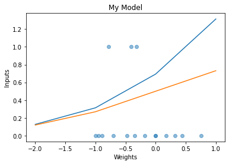

# NeuralMXClassifier
My neural network can classify 4 types of matrices that represent either a "right/left line, or a bottom-top/top-bottom diagonal line"

# Inputs V Weights graph after training:

# Saved weights
I saved the weights under `weights.npy` and to use those weights, uncomment the `load()` function.
